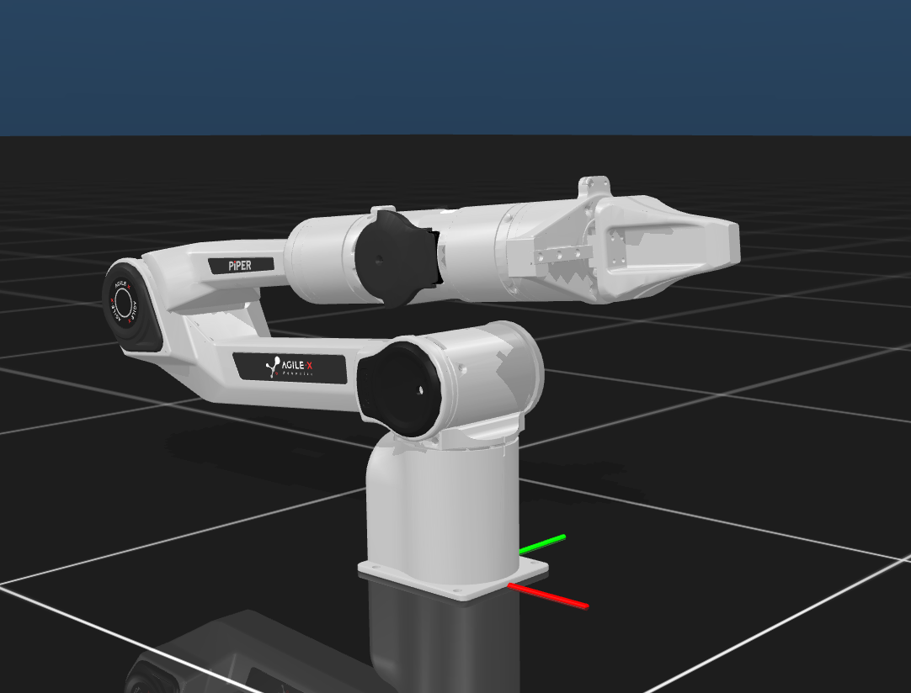

## AgileX PiPER 描述文件 (MJCF)



### 文件架构

```
|
|- assets: 模型文件
|- PIPER.png: 本体图像
|- PIPER.xml: MJCF 文件
|- scene.xml: 引用示例
|- Variant: 拓展模型
```

### 资料来源

https://github.com/google-deepmind/mujoco_menagerie/tree/main/agilex_piper

### 拓展资源

1. Unimanual_Piper_withTable: 单臂（带操作台）
2. Bimanual_Piper_withTable: 双臂（带操作台）
