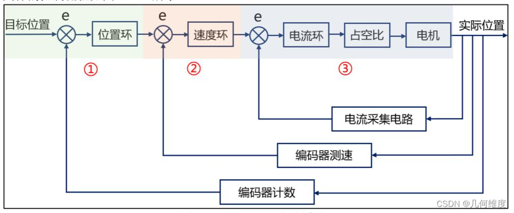

## 电机三环PID控制
[公式参考](https://blog.csdn.net/zkmrobot/article/details/144023115)

最经典且应用面最广的方法(工业界90%)

三环嵌套闭环的反馈控制架构，通过位置环、速度环、电流环的逐级调节，让关节精准跟踪目标指令，同时保证运动过程的平稳性和抗干扰能力。

### 位置环，计算目标速度
伺服驱动器中的位置控制器（常用PID算法或模型预测控制算法），计算目标位置$\theta$与编码器反馈的实际位置$\theta^{cur}$的偏差$\Delta \theta = \theta - \theta^{cur}$。

根据位置偏差，位置环输出目标速度$\omega$。偏差大时输出较大的目标速度，加快运动；偏差小时输出较小的目标速度，避免超调。

### 速度环，计算目标电流
速度控制器（多为 PI/PID 算法），计算目标速度$\omega$与实际速度$\omega^{cur}$的偏差$\Delta \omega = \omega - \omega^{cur}$,实际速度由编码器的位置信号微分计算得到）。

根据速度偏差，速度环输出目标电流$I$。电机扭矩与电流成正比$T = K_t \cdot I$，因此目标电流本质是目标扭矩指令: 需要更大扭矩时，输出更大的目标电流。

### 电流环，输出驱动信号
电流控制器根据目标电流$I$与实际电流$I^{cur}$的偏差，输出PWM信号。

PWM 信号驱动功率开关器件（IGBT/MOSFET），调节电机绕组电流，产生对应扭矩，驱动关节运动。

## 关节Position控制
根据目标位置和限速，规划平滑的运动轨迹。（梯形速度曲线， S型速度曲线）: 将 “从当前位置到目标位置” 的运动，分解为 “加速→匀速→减速” 三个阶段，计算出每个采样周期的 “细分位置指令”

将分段的指令发送给电机。

驱动器激活 位置环→速度环→电流环 的三环 PID 闭环：

位置环：对比 “目标位置” 和 “编码器反馈的实际位置”，输出目标速度；

速度环：对比 “目标速度” 和 “实际速度”，输出目标电流；

电流环：对比 “目标电流” 和 “实际电流”，输出 PWM 信号驱动电机；

电机带动关节按规划轨迹运动，编码器实时采集实际位置并反馈给驱动器，直到位置偏差小于设定阈值。

## 关节Velocity控制
驱动器接收到指令后，解析出目标速度值，启动内部的 速度环 + 电流环 闭环控制（就是之前讲的速度控制原理）；

驱动器通过编码器实时采集关节实际速度，与目标速度对比，调节电机电流，让实际速度跟踪目标速度。

## 关节Torque控制
首先将扭矩按照百分比，转换为驱动器的“目标电流值”，（电机扭矩和相电流成正比）

驱动器解析出目标电流值，仅保留电流环，直接控制电机绕组电流。

电流传感器实时采集实际电流，换算为实际扭矩，与目标扭矩对比，动态调节 PWM 信号，保证扭矩跟踪精度。
