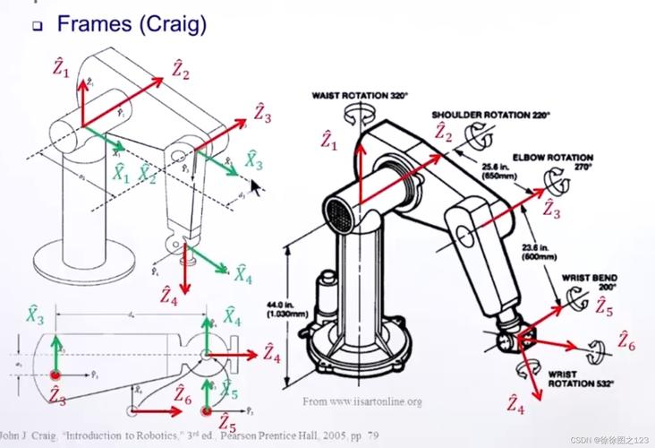

## 简介
本文档旨在介绍机械臂运动相关的基础知识，让读者理解经典算法实现的接口，从而接入到各种算法、项目中。

## 基础概念

### 基座标系与关节坐标系
不同于移动平台，机械臂有一个固定在其他物体（可以是移动平台）的基座。为了便于计算，通常所有的坐标信息都需要投影到这个**基坐标系**下，然后进行机械臂相关的解算及运动控制。
piper在仿真空间的基座标系定义如下：
	原点：机械臂基座中心	
    z轴：竖直向上，与第一个关节的转动轴平行
	x轴：piper各个关节**零位**时，机械臂的夹爪朝向（与最后一个手腕关节的转动轴平行）
	y轴：右手定则： 满足z = np.cross(x, y)的y的方向

关节坐标系为定义在各个关节的坐标系，由于机械臂的各个连杆是刚性的，因此连杆在连杆端点处的关节坐标系中的描述是固定的。关节坐标系主要是为了简化连杆的描述方式，关节坐标系的定义由厂商决定。在urdf和mjcf中可以找到描述。以下是关节坐标系描述的示意图。

### 点和向量在坐标系下的描述
#### 点在各个坐标系下的描述及转换
记点p在A坐标系下的坐标${^A \textbf{p}} = [x, y, z, 1]$， 我们可以通过如下公式计算点在O坐标系下的坐标：
$$
{^O\textbf{p}} = {^O_A T} \cdot {^A\textbf{p}}
$$
其中$^O_A T$表示一个4x4矩阵, 在O坐标系下，描述A坐标系是如何从O坐标系变换得到的（O to A）. 
$$
T = \begin{bmatrix} R&p\\0&1 \end{bmatrix}
$$
$R$是一个表示旋转的3x3矩阵，$p$是一个描述平移的列向量。

#### 向量在各个坐标系下的描述和转换
一个向量的描述依赖起点坐标，当起点未给定时，一个向量的描述表示一组平行的向量。因此，向量在不同的坐标系下的描述只与旋转有关。记向量r在A坐标系下的描述${^A r} =[x, y, z]$，则有：
${^O r} = {^O_A R} \cdot {^A r}$, 其中 $R = T[:3, :3]$ 

### 机械臂D-H矩阵
D-H矩阵是一种齐次变换矩阵，描述机械臂**相邻关节**对应的关节坐标系下的坐标描述，即$^n_{n+1} T$。
D-H矩阵分为SDH和MDH描述方式，仅考虑运动学的情况下，两者区别不大。
在现实环境下，piper厂家提供了MDH的描述方式；在仿真环境中，可以通过pinocchio从urdf或mjcf文件读取。

### 机械臂末端执行器描述
通常我们可以得到机械臂末端执行器的结构，从而获取末端执行器的夹取点在**最后一个**关节坐标系下的描述。对于piper机械臂，夹爪夹取点在joint6坐标系下的描述为坐标：
${^6 \textbf{p}} = [0, 0, 0.145, 1]^T$	
当机械臂关节位置确定时，可以确定各个D-H矩阵，从而得到在该状态下，末端执行器在机械臂**基坐标系**下的描述，6轴机械臂的末端执行器描述方式如下：
${^O \textbf{p}} ={^O_1 T} \cdot {^1_2 T} \cdot {^2_3 T} \cdot {^3_4 T} \cdot {^4_5 T} \cdot {^5_6 T} \cdot {^6 \textbf{p}}$,
${^O \textbf{R}} = {^O_1 R} \cdot {^1_2 R} \cdot {^2_3 R} \cdot {^3_4 R} \cdot {^4_5 R} \cdot {^5_6 R}$

R是特殊正交群SO3的一个元素，通常可以使用四元数和欧拉角描述。
[四元数与欧拉角](https://zhuanlan.zhihu.com/p/79894982)

## 机械臂正运动学(forward kinematics)
fk定义为末端执行器的姿态和关节角度的关系，即已知关节角度q，计算末端执行器的位姿。
当q已知时，可以计算得到T矩阵，从而得到末端执行器在基坐标系下的描述。
${^O \textbf{p}}, {^O \textbf{R}} = fk(\textbf{q})$
${^{i-1}_i T}, {^{i-1}_i R} = DH(\textbf{q}_i)$

一般地，只需关注末端执行器的位置即可。姿态的计算求解较为复杂。

## 机械臂逆运动学(inverse kinematics)
ik定义为关节角度和末端执行器的关系，与fk相对，即已知末端执行器位姿，计算关节角度。
$\textbf{q} = ik({^O \textbf{p}}, {^O \textbf{R}})$
使用数值法求解ik时，由于机械臂构型的设置，求解ik时存在多解或无解的情况。可以考虑优化的方式设置合适的cost function进行求解，同时验证计算结果。pinocchio内置了通用求解方式，进行逆运动学求解。机器人关节状态到末端的状态是一个非线性映射，而且中间过程对应的状态空间是非凸的。因此，数值方法是有局限性的。
机械臂的构型满足一定条件时，解析解才存在。一般地，厂家不会开源解析解算法。
[参考链接](https://zhuanlan.zhihu.com/p/450749372)
